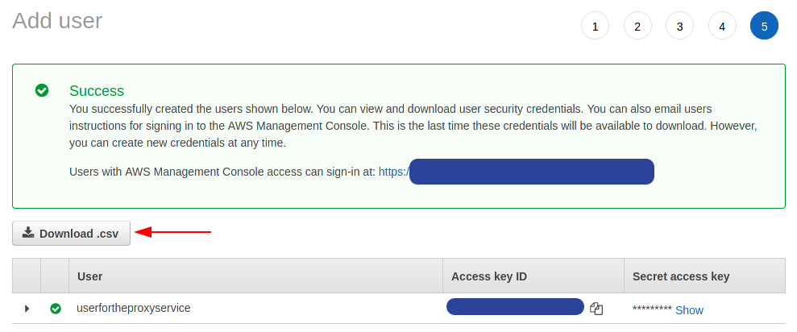

# NFT Image Proxy
Image Proxy supporting automatic content moderation for use with Tezos Wallets and other applications in the ecosystem.

The proxy supports the following features:
1. Fetching images from either `HTTP` or `IPFS` urls. 
1. The following image formats are supported: `bmp`, `jpg`, `png`, `tiff`, `gif`.
1. Automatic content moderation by hooking with a moderation provider.
   1. Automatic format conversion to a format supported by the moderation provider.
   1. Automatic image resizing to support file size limits set by the moderation provider.
1. Caching of moderation results to a database thus enabling quick responses to content fetch requests.
1. User reporting of content that slips by the automatic moderation.

The proxy currently support AWS Rekognition as its moderation provider. There are plans for introducing other providers such as Azure in the future.

A limited time preview server is available for folks interested in testing at the following url: `https://imgproxy-preview.cryptonomic-infra.tech`.

See the [API](#API) section for working examples. These examples will work against the above listed preview server.

See the [Endpoints](#Endpoints) section for information about prometheus metrics and the internal ui dashboard.

<br/>

## Future Work
Here are some of things we are considering for future releases:

1. Moderation policy for handling user reports.
1. NPM library to make integration easier with the API.
1. Enhanced administration dashboard
1. Image caching support (S3)   
1. Ability to customize list of categories which should be blocked by the proxy.
1. Azure Moderation service

<br/>
<br/>

# Quick Start
A docker compose file is provided with this repository. The following steps will allow you to setup your own proxy service:

1. Create an AWS account if you don't have one. Moderation features only work if you connect the proxy to AWS.
1. Create an IAM user with read permissions for Rekognition. Screenshots are provided below as guide. **We strongly recommend that you read the AWS IAM documentation to understand the security implications. See AWS [documentation](https://docs.aws.amazon.com/rekognition/latest/dg/security_iam_service-with-iam.html) for more information.**


1. Create and download a AWS Access Keys from the IAM for the user you created in the previous step. Keep this information safe!


1. Create and `.env` file in the project root with the following contents:
    ```
    AWS_ACCESS_KEY_ID=<YOUR AWS ACCESS KEY ID>
    AWS_SECRET_ACCESS_KEY=<YOUR AWS ACCESS KEY>
    ```
1. Modify the configuration files `proxy.conf` to suit your needs. Pay attention to the AWS region setting. Ideally this should be set to the same region as where your proxy server is hosted. See AWS documentation on all possible values.
1. Start the containers `docker-compose up`
1. Test if the service is up by visiting `http://localhost:3000/info` on your browser.

Note that native CORS support is not baked in yet, but is upcoming very soon in a future PR. For the time being we recommend that you place a nginx reverse proxy in front of the service to handle CORS.

# API

This is a JSON rpc based API. Every request made to the rpc endpoint must have the following set:

1. The request method should be POST.
1. A JSON request object in the body.
1. The content type header must be set to `application/json`.
1. A header called `apikey` must be set and a valid key must be provided. In case an invalid api key is provided the api will respond with a `403 FORBIDDEN` error.

The following methods are supported by the proxy:

1. `img_proxy_fetch` : Fetch images from a remote location.
1. `img_proxy_describe` : Describe any moderation results stored in the database for a given url.
1. `img_proxy_report` : Allows users to report a url as having objectionable content.
1. `img_proxy_report_describe` : Dumps all prior user reports

Responses in general will all have `200 OK` as their status along with the following json body in the response:
```json
    {
        "jsonrpc": "1.0.0",
        "code": "<Enumerated Status Code>",
        "results": { // Optional property
            // Method specific results
        }
    }
```

<br/>

## Fetching Images (img_proxy_fetch)

This method is used for fetching an image and for applying content moderation on it. A client must provide two parameters with each request:

1. The url of the image. This must either use the `HTTP` or `IPFS` scheme.
1. A `force` flag, indicating whether they want moderation or not. If this flag is set, the image is returned as is regardless of what moderation may say.

Note that the resource being fetched must be of an image type otherwise the proxy will return a `UnsupportedImageType` code.

The response from this method depends on the results of moderation:
1. Image is deemed safe - The original image is returned as is, with the header type set to what the remote server returned e.g. `image/png`.
1. Image is deemed not safe - A JSON response potentially explaining why the image was blocked.

### Example #1 - A safe image

The following request will fetch and save the image as `reef.jpg`.

```shell
curl -o reef.jpg --location --request POST 'https://imgproxy-preview.cryptonomic-infra.tech' \
--header 'apikey: 134472c4dd9118dbff1ed4e5fc7f1d056a0d690c9b6cc47c5c2453a011f57127' \
--header 'Content-Type: application/json' \
--data-raw '{
    "jsonrpc": "1.0.0",
    "method": "img_proxy_fetch",
    "params": {
        "url": "https://upload.wikimedia.org/wikipedia/commons/1/1b/GreatBarrierReef-EO.JPG",
        "force": false
    }
}'
```

### Example #2 - An moderated image

The following request should produce a JSON response:
```shell
curl --location --request POST 'https://imgproxy-preview.cryptonomic-infra.tech' \
--header 'apikey: 134472c4dd9118dbff1ed4e5fc7f1d056a0d690c9b6cc47c5c2453a011f57127' \
--header 'Content-Type: application/json' \
--data-raw '{
    "jsonrpc": "1.0.0",
    "method": "img_proxy_fetch",
    "params": {
        "url": "https://upload.wikimedia.org/wikipedia/commons/8/84/Michelangelo%27s_David_2015.jpg",
        "force": false
    }
}'
```

The response should look like:
```json
{
  "jsonrpc": "1.0.0",
  "code": "DocumentBlocked",
  "result": {
    "categories": [
      "ExplicitNudity",
      "Suggestive"
    ]
  }
}
```

<br/>
<br/>

## Describing Moderation Results (img_proxy_describe)

This method is used to fetch cached moderation results from the service. The results will indicate whether the provided urls are `Allowed`, `Blocked` or `NeverSeen` by the proxy.

An example request is as thus:
```
curl --location --request POST 'https://imgproxy-preview.cryptonomic-infra.tech' \
--header 'apikey: 134472c4dd9118dbff1ed4e5fc7f1d056a0d690c9b6cc47c5c2453a011f57127' \
--header 'Content-Type: application/json' \
--data-raw '{
    "jsonrpc": "1.0.0",
    "method": "img_proxy_describe",
    "params": {
        "urls":[ "https://upload.wikimedia.org/wikipedia/commons/1/1b/GreatBarrierReef-EO.JPG", "https://upload.wikimedia.org/wikipedia/commons/8/84/Michelangelo%27s_David_2015.jpg",  "https://localhost:3000" ]
    }
}'
```

The following response is expected:
```json
{
  "jsonrpc": "1.0.0",
  "code": "Ok",
  "result": [
    {
      "url": "https://upload.wikimedia.org/wikipedia/commons/1/1b/GreatBarrierReef-EO.JPG",
      "status": "Allowed",
      "categories": [],
      "provider": "Aws"
    },
    {
      "url": "https://upload.wikimedia.org/wikipedia/commons/8/84/Michelangelo%27s_David_2015.jpg",
      "status": "Blocked",
      "categories": [
        "ExplicitNudity",
        "Suggestive"
      ],
      "provider": "Aws"
    },
    {
      "url": "https://localhost:3000",
      "status": "NeverSeen",
      "categories": [],
      "provider": "None"
    }
  ]
}
```

<br/>
<br/>

## Reporting Urls by Users (img_proxy_report)

This method allows users to report objectional content to the proxy. Once a report is successfully registered a report Id will be made available to the user.

An example request is thus:
```shell
curl --location --request POST 'https://imgproxy-preview.cryptonomic-infra.tech' \
--header 'apikey: 134472c4dd9118dbff1ed4e5fc7f1d056a0d690c9b6cc47c5c2453a011f57127' \
--header 'Content-Type: application/json' \
--data-raw '{
    "jsonrpc": "1.0.0",
    "method": "img_proxy_report",
    "params": {
        "url": "https://localhost:3000/Plata_O_Plomo.gif",
        "categories": ["Drugs"]
    }
}'
```

And the typical expected response should look like:
```json
{
    "jsonrpc": "1.0.0",
    "code": "Ok",
    "result": {
        "url": "https://localhost:3000/Plata_O_Plomo.gif",
        "id": "e82b99b4-4d72-45d8-9f39-4aef10d89e3e"
    }
}
```

## Fetching User reported urls (img_proxy_report_describe)

This method is used to fetch all reports filed by users. This is typically useful for an UI or an proxy operator who wishes to inspect the internals.

**Note that in the future this method may be made administrator only.**

The request looks like this:
```shell
curl --location --request POST 'https://imgproxy-preview.cryptonomic-infra.tech' \
--header 'apikey: 134472c4dd9118dbff1ed4e5fc7f1d056a0d690c9b6cc47c5c2453a011f57127' \
--header 'Content-Type: application/json' \
--data-raw '{
    "jsonrpc": "1.0.0",
    "method": "img_proxy_describe",
    "params": {
        "urls":[
             "https://upload.wikimedia.org/wikipedia/commons/1/1b/GreatBarrierReef-EO.JPG", "https://upload.wikimedia.org/wikipedia/commons/8/84/Michelangelo%27s_David_2015.jpg", "https://localhost:3000/Plata_O_Plomo.gif" ]
    }
}'
```

A typical response should look like this:
```
{
    "jsonrpc": "1.0.0",
    "code": "Ok",
    "result": [
        {
            "url": "https://upload.wikimedia.org/wikipedia/commons/1/1b/GreatBarrierReef-EO.JPG",
            "status": "Allowed",
            "categories": [],
            "provider": "Aws"
        },
        {
            "url": "https://upload.wikimedia.org/wikipedia/commons/8/84/Michelangelo%27s_David_2015.jpg",
            "status": "Blocked",
            "categories": [
                "ExplicitNudity",
                "Suggestive"
            ],
            "provider": "Aws"
        },
        {
            "url": "https://localhost:3000",
            "status": "NeverSeen",
            "categories": [],
            "provider": "None"
        }
    ]
}
```

# Endpoints

The service supports two endpoints:

1. `/metrics` - Prometheus metrics, must be enabled via configuration.
1. `/admin` - TBD